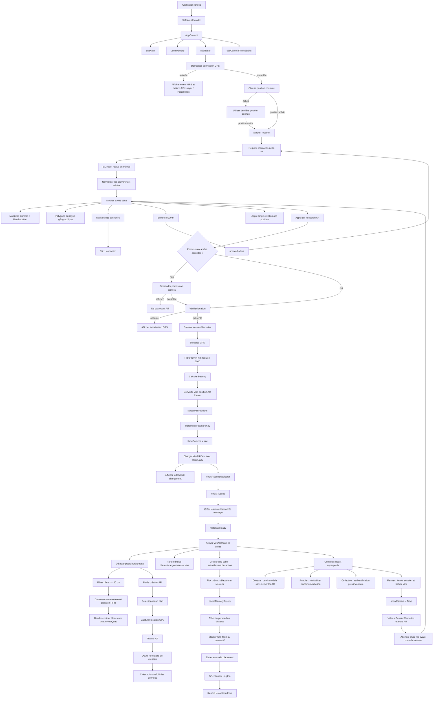

# ECHOES - Synthèse de la reprise

Date : 6 octobre 2026

## Résultat actuel

Le problème critique d'entrée dans la vue AR est corrigé sur l'appareil de test.

La cause la plus probable était une course entre la demande de permission caméra, les événements de cycle de vie Android (`onHostPause` / `onHostResume`) et un garde `AppState` qui abandonnait silencieusement l'ouverture AR avant que l'activité ne soit redevenue `active`.

L'ouverture ne dépend plus d'une manipulation préalable de la carte. La carte et l'AR sont maintenant deux états d'affichage exclusifs.

## Fonctionnalités et corrections métier

### Rayons géographiques

- Le curseur de la carte utilise une plage de `5` à `5000` mètres, par pas de `5` mètres.
- La requête serveur envoie directement `radius` en mètres.
- La conversion erronée en kilomètres a été supprimée.
- Le rayon de la carte est dessiné avec un polygone géographique réel.
- Le rayon maximal de l'AR est plafonné à `5000` mètres.
- Les positions AR sont compressées dans un espace virtuel d'environ `5` mètres pour conserver une scène lisible malgré un rayon GPS de plusieurs kilomètres.

### Positionnement des souvenirs

- La distance GPS et le relèvement sont calculés à l'ouverture de la session AR.
- Les positions relatives sont capturées dans `arSessionMemories`.
- Les souvenirs ne changent pas de place pendant la session.
- Les positions voisines sont espacées pour éviter le chevauchement des bulles.
- La session conserve les positions relatives jusqu'à la fermeture de la vue AR.

### Plans et placement

- Les plans horizontaux détectés sont conservés en FIFO, avec une limite de six plans.
- La taille minimale d'un plan est de `30 cm`.
- Le rendu utilise `ViroARPlane` avec quatre `ViroQuad` formant uniquement un contour blanc opaque.
- Une tentative de figer les plans dans des `ViroNode` a été abandonnée car elle provoquait un crash natif.
- Le flux prévu est :
  1. télécharger et mettre les médias en cache ;
  2. entrer en mode placement ;
  3. attendre la détection d'un plan ;
  4. sélectionner le plan ;
  5. afficher le contenu local sur ce plan.
- Le bandeau d'aide et le bouton d'annulation sont placés sous la barre supérieure, sans recouvrir les contrôles système.
- L'annulation réinitialise l'objet placé, le mode création et les états de chargement.

### Bulles AR

- Diamètre cible : `15 cm` (`7,5 cm` de rayon).
- Souvenirs du compte courant : bleu translucide.
- Souvenirs des autres utilisateurs : orange translucide.
- Les bulles sont positionnées à partir des coordonnées relatives calculées depuis la carte.
- Les interactions Viro sont maintenant réactivées avec `AR_INTERACTIONS_ENABLED = true`, après stabilisation de l'ouverture AR.
- Une bulle n'est plus sélectionnée automatiquement à l'entrée : l'utilisateur commence avec toutes les bulles visibles.
- Les surfaces de sélection des plans restent actives pour chaque plan détecté ; elles ne dépendent plus de l'absence d'un plan déjà sélectionné.
- Les bulles utilisent un matériau Phong translucide avec `alpha`. Le shader rim a été retiré après un crash natif Viro pendant `material.addShaderModifier`.
- La fermeture de l'AR après sélection d'un plan en mode création est différée d'un tick JS afin de ne pas démonter Viro pendant l'exécution de son callback natif.
- Une tentative de shader rim a d'abord corrigé la précision GLSL ES 3, mais le moteur Viro 3.0.2 a ensuite crashé pendant l'enregistrement natif de `shaderModifiers`; aucun shader personnalisé n'est donc conservé.
- Après suppression du shader, le crash persistait pendant l'enregistrement des matériaux nommés (`VRTMaterialManager`). La scène est donc temporairement rendue sans `ViroMaterials.createMaterials()` ni noms de matériaux, pour isoler ce chemin natif.
- Le crash persistant sans matériaux survient avant le rendu applicatif. La caméra explicite `ViroARCamera` a donc été retirée temporairement : `ViroARScene` utilise sa caméra AR interne, comme dans l'exemple officiel de détection de plans.
- `ViroCamera` ne doit pas être importé ou rendu dans `App.js` : en AR, `ViroARCamera` est le composant prévu et encapsule la caméra native avec `active={true}`. Viro 3.0.2 n'expose pas de prop `depthOfField`, `focus` ou `autofocus` sur cette caméra.
- La réception des ancres accepte désormais les événements Viro qui omettent les dimensions `width`/`height`; le seuil de 30 cm reste appliqué lorsque ces dimensions sont fournies.

### Médias et cache

- Les modèles, images, vidéos et audios sont téléchargés dans le cache local avant leur affichage dans la scène AR.
- Les URI distantes protégées ne sont pas utilisées pour le rendu placé lorsque le cache local est disponible.
- Les URI locales utilisées par Viro sont de type `file://` ou `content://`.
- La session AR est synchronisée avec les versions mises en cache arrivant après son ouverture.
- Un indicateur de chargement est prévu pendant la préparation et le chargement du contenu.

### Création et collection

- La création et la collection nécessitent une authentification.
- Hors connexion, les boutons restent visibles mais ouvrent la modale de compte.
- Le placement reste accessible sans connexion.
- La collection locale est persistée avec `useInventory`.
- Un appui long de `650 ms` avait été prévu pour collecter les modèles, images, vidéos et objets de secours ; les interactions natives sont désactivées pour le diagnostic actuel.
- La création propose photo, vidéo, audio et objet 3D.
- Les modèles GLB proposés sont `unicorn.glb`, `butterfly.glb` et `fish.glb`.
- Les fichiers GLB sont déclarés comme assets Metro et envoyés en multipart sous `contents[index][model_3D]`.

## Stabilité native Viro / Android

Le crash observé était :

```text
VROPlatformUtil.cpp:570
Function: getJNIEnv
Expression: sVM != nullptr
Fatal signal 11 (SIGSEGV)
```

Le chemin `/Users/dorantes/...` est le chemin de compilation interne de ViroReact ; il ne correspond pas à un utilisateur de l'application.

Les mesures appliquées ont été :

- suppression de la configuration Viro non documentée `provider: "none"` ;
- suppression de la prop non documentée `lightEstimationEnabled` ;
- déplacement de `ViroMaterials.createMaterials()` dans un `useEffect` après montage ;
- rendu des éléments dépendant des matériaux uniquement après `materialsReady` ;
- restauration de `ViroARPlane` après l'essai de rendu statique des plans ;
- désactivation temporaire de tous les handlers tactiles Viro ;
- chargement différé de `ViroARView` avec `React.lazy()` afin de ne pas initialiser Viro sur la carte ;
- suppression du garde `AppState` qui pouvait annuler l'entrée AR juste après la permission caméra ;
- conservation du délai de sécurité de `1500 ms` après fermeture avant de recréer une session Viro ;
- reconstruction native avec `prebuild --clean` puis build APK release pour éliminer les artefacts Gradle/Java persistants.

## Diagramme détaillé : démarrage et session AR



## États principaux

| État | Rôle |
|---|---|
| `location` | Position GPS utilisée pour la carte, les requêtes et la création AR |
| `radius` | Rayon serveur et rayon de filtrage AR, en mètres |
| `memories` | Souvenirs normalisés reçus du serveur |
| `arSessionMemories` | Snapshot des souvenirs et positions relatives de la session |
| `showCamera` | Choisit entre l'écran carte et l'écran AR |
| `cameraKey` | Force une nouvelle instance du navigateur Viro |
| `selectedMemoryToPlace` | Souvenir préparé pour un placement |
| `selectedArMemory` | Souvenir sélectionné depuis l'AR |
| `isPlacingMode` | Affiche le mode de sélection d'un plan |
| `isCreatingInAR` | Affiche le mode création depuis l'AR |
| `isPreparingPlacement` | Téléchargement/cache avant placement |
| `isModelLoading` | Chargement du contenu local dans Viro |
| `resetPlacedMemoryKey` | Réinitialisation du contenu placé après annulation |

## Fichiers principaux modifiés

- [app/App.js](./app/App.js) : orchestration carte, permissions, AR, authentification, création et collection.
- [src/components/ViroARView.tsx](./src/components/ViroARView.tsx) : scène Viro, plans, bulles, matériaux et contenu placé.
- [src/components/ViroAR.types.ts](./src/components/ViroAR.types.ts) : contrats TypeScript de la scène AR.
- [src/utils/geo.js](./src/utils/geo.js) : distances, bearings, rayon cartographique et positions AR.
- [src/hooks/useRadar.js](./src/hooks/useRadar.js) : GPS, requêtes serveur et cache des médias.
- [src/hooks/useInventory.js](./src/hooks/useInventory.js) : collection locale.
- [src/components/CreateMemoryModal.js](./src/components/CreateMemoryModal.js) : création photo/vidéo/audio/GLB.
- [src/services/api.js](./src/services/api.js) : multipart et modèles 3D.
- [constants/i18n.js](./constants/i18n.js) : traductions ajoutées.
- [app.json](./app.json) : configuration Expo/Viro et nouvelle architecture.
- [metro.config.js](./metro.config.js) : assets GLB.

## Points restant à reprendre

1. Tester sur appareil la sélection de plusieurs plans et de plusieurs bulles successivement.
2. Tester la création AR après sélection d'un plan, notamment la fermeture différée de la scène.
3. Tester l'appui long de collection maintenant que les interactions Viro sont réactivées.
4. Tester le cycle arrière-plan / premier plan Android avec une session AR active.
5. Vérifier le rendu réel et l'échelle des plans et bulles translucides sur plusieurs appareils.
6. Corriger le warning Expo Router concernant `theme.js` s'il reste présent :
   `Route "./theme.js" is missing the required default export`.
7. Refaire un passage de validation TypeScript et lint après les prochains changements.
8. Nettoyer les éventuels daemons Gradle résiduels uniquement si un problème de build réapparaît.
